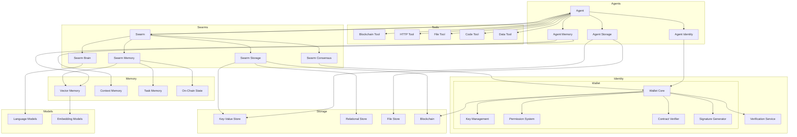

# Swarms-Rust Component Relationships

## System Components

## Wallet Component Details

### Core Components
1. Wallet Core
   - Identity management
   - Address generation
   - Transaction handling
   - State management

2. Key Management
   - Private key storage
   - Key rotation
   - Backup/recovery
   - Access control

3. Permission System
   - Operation authorization
   - Role management
   - Access policies
   - Threshold controls

4. Contract Verifier
   - Code analysis
   - Risk assessment
   - Safety verification
   - Interaction validation

5. Signature Generator
   - Message signing
   - Transaction signing
   - Signature verification
   - Format handling

### External Integrations
1. Blockchain
   - Transaction submission
   - State queries
   - Event monitoring
   - Network selection

2. Verification Service
   - Identity verification
   - Signature validation
   - Chain validation
   - Trust anchoring

### Integration Points
1. Agent Integration
   - Identity verification
   - Operation signing
   - State management
   - Permission checks

2. Swarm Integration
   - Consensus signing
   - Multi-sig operations
   - Vote collection
   - Result verification

## Component Details

### Agent Components
- Agent: Core agent implementation
- Agent Tools: Task processing capabilities
- Agent Storage: Local data management
- Agent Memory: Context and history
- Agent Identity: Blockchain verification

### Swarm Components
- Swarm: Orchestration layer
- Swarm Brain: Decision making
- Swarm Storage: Shared state
- Swarm Memory: Collective memory
- Swarm Consensus: Agreement protocols

### Storage Components
- Key-Value Store: Configuration/metadata
- Relational Store: Structured data
- File Store: Temporary/large data
- Blockchain Ledger: Immutable transaction/state history

### Memory Components
- Vector Memory: Embeddings storage
- Context Memory: Interaction history
- Task Memory: Processing state
- On-Chain State: Active blockchain state/memory

### Model Components
- Language Models: Text generation
- Embedding Models: Vector encoding

### Tool Components
- Blockchain Tool: Chain interaction and state management
- HTTP Tool: External service communication
- RPC Tool: Remote procedure calls
- File Tool: File system operations
- Code Tool: Code execution and analysis
- Data Tool: Data processing and transformation

### Identity Components
- Wallet: Blockchain identity
- Signature verification
- Message authentication

### Tool Integration
1. Core Tools
   - Blockchain: Chain interaction and verification
   - HTTP/RPC: Service communication
   - File System: Data persistence
   - Code Execution: Task processing
   - Data Processing: Analysis and transformation

2. Tool Management
   - Tool registration
   - Capability discovery
   - Access control
   - Resource management
   - Error handling

3. Tool Integration Points
   - Agent tool usage
   - Swarm tool coordination
   - Cross-tool communication
   - Resource sharing
