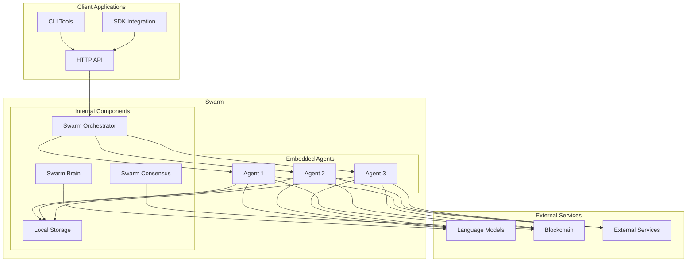
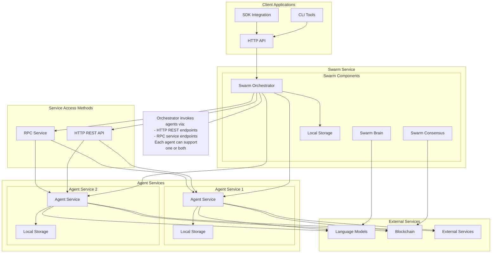
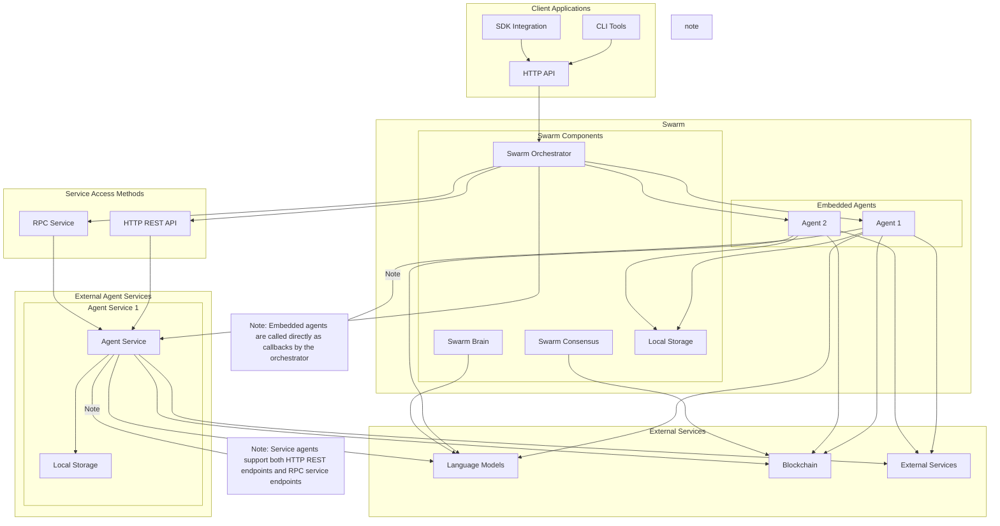
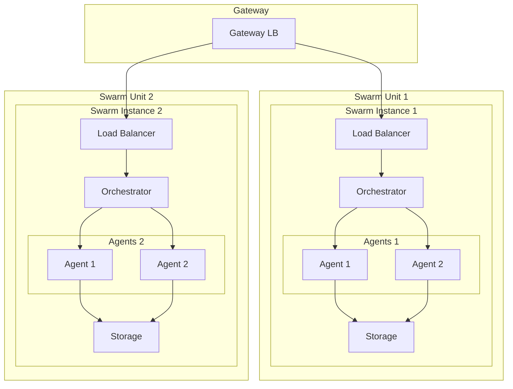
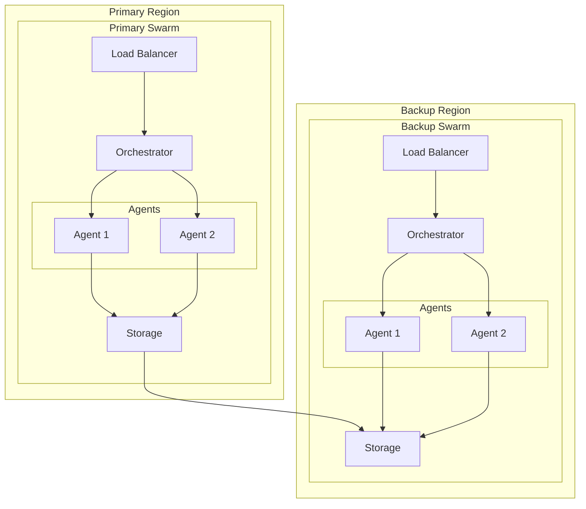

# Swarms-Rust Deployment Architecture

## Deployment Patterns

### 1. Embedded Deployment

### 2. Service-Based Deployment

### 3. Hybrid Deployment

## Deployment Details

### Client Layer
- CLI Tools: Command-line interface
- SDK Integration: Library integration
- HTTP API: RESTful interface

### Core Services
1. Swarm Service
   - Orchestrator: Task management
   - Brain: Decision making
   - Consensus: Agreement protocols

2. Agent Service
   - Manager: Agent lifecycle
   - Pool: Agent instances
   - Tools: Processing capabilities

3. Storage Services
   - Key-Value: Fast access
   - Relational: Structured data
   - File: Large objects
   - Blockchain: Immutable ledger storage

4. Memory Service
   - Vector: Embeddings
   - Context: History
   - Metadata: System data

### External Services
- Language Models: AI processing
- Blockchain: Identity/verification
- External Services: Integration points

## Scaling and Availability

### Atomic Unit Scaling

### High Availability with Atomic Units

