# Swarms-Rust Interaction Sequences

## Task Processing Sequence
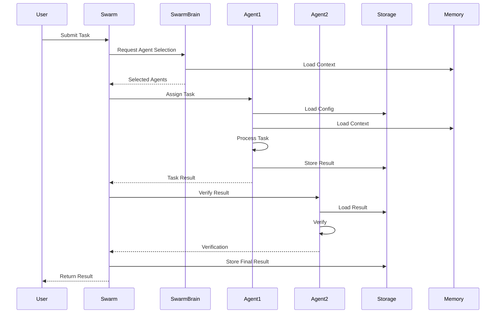

## On-Chain Vote Collection and Consensus Sequence
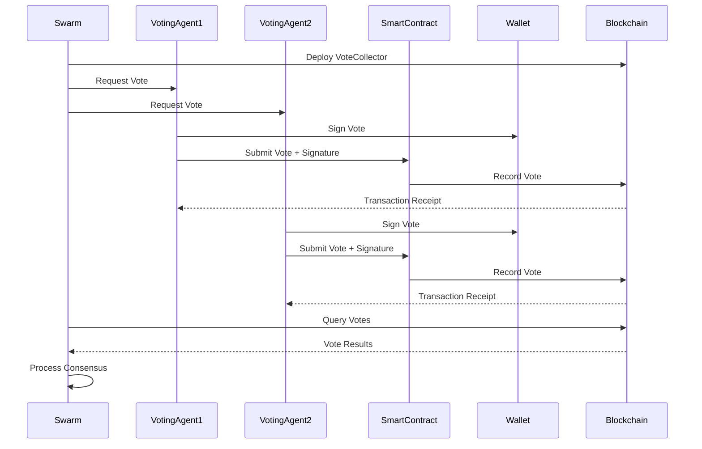

## Off-Chain Vote Collection and Consensus Sequence
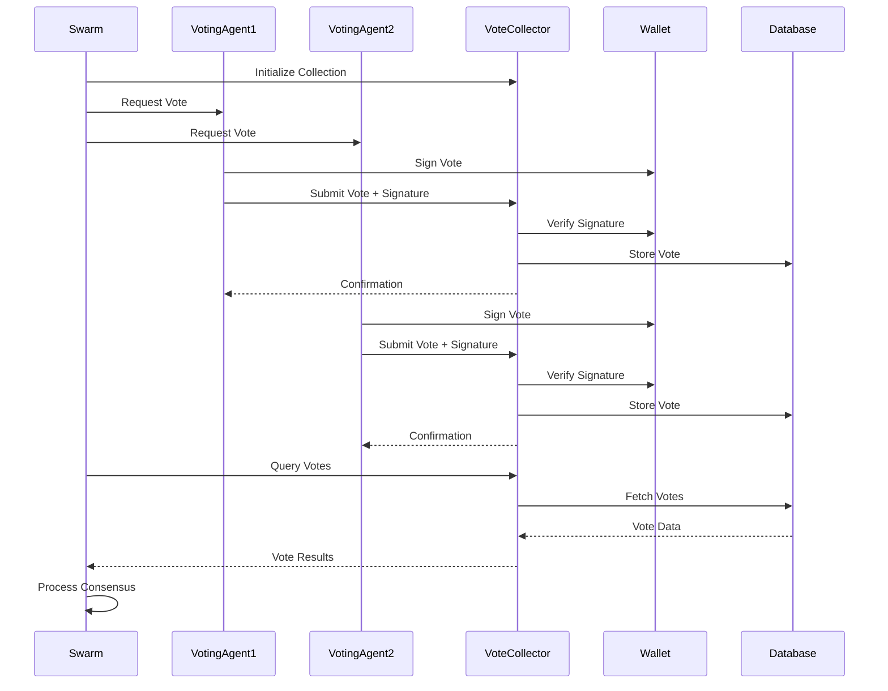

## Hybrid On-Chain/Off-Chain Consensus Sequence
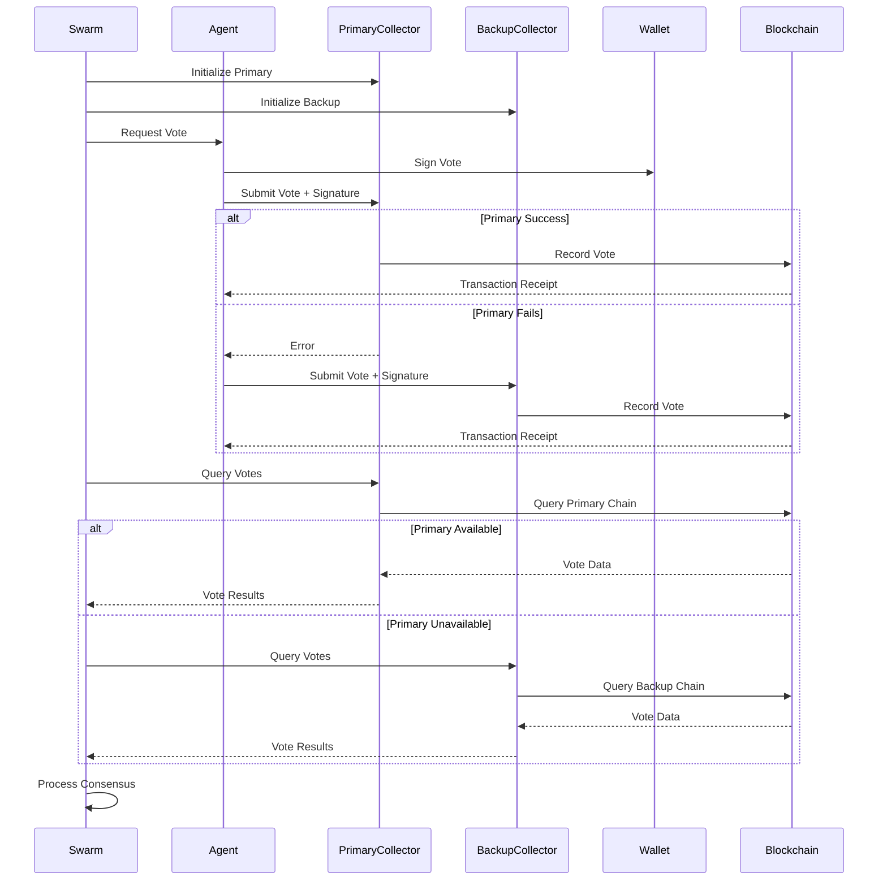

## On-Chain Consensus Building and Decision Sequence
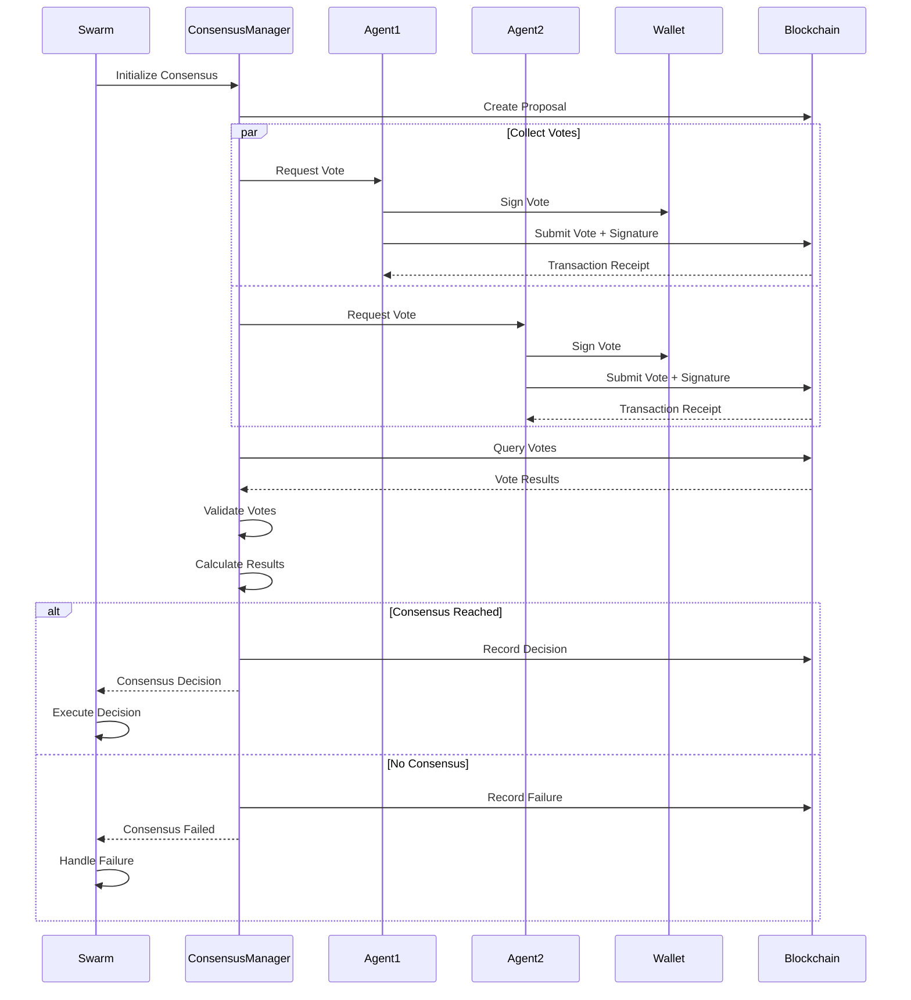

## Consensus Building Sequence
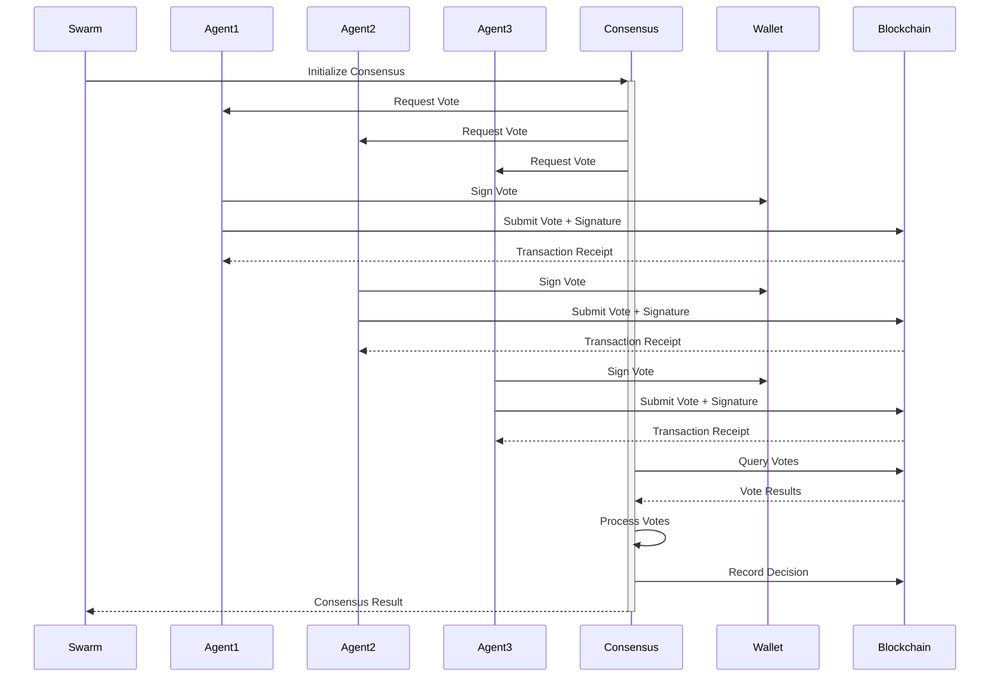

## Storage Operation Sequence
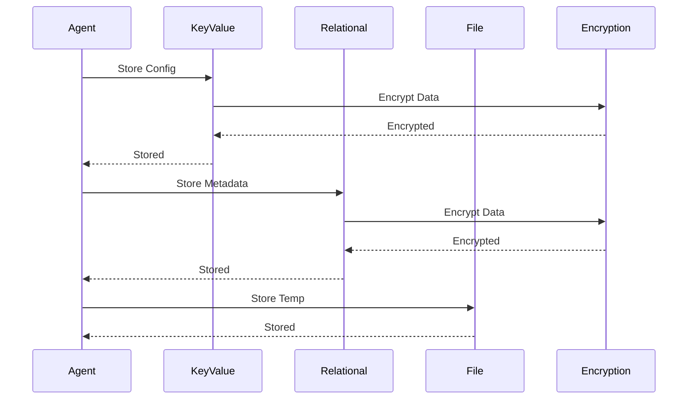

## Memory Integration Sequence
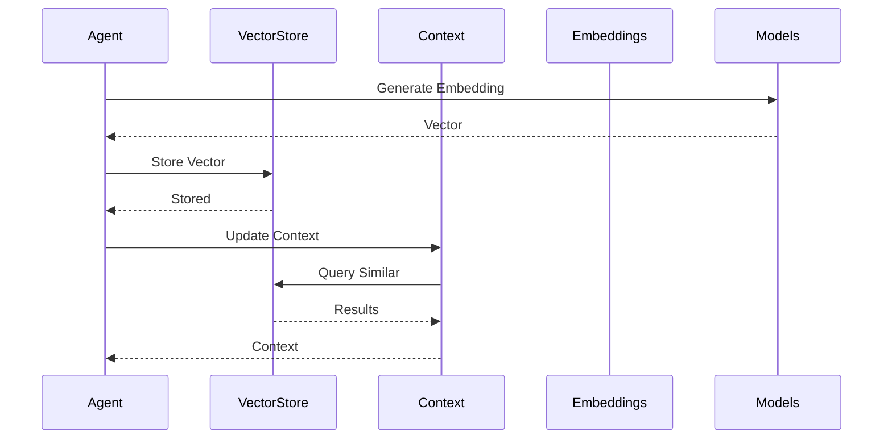

## Wallet Integration Sequence
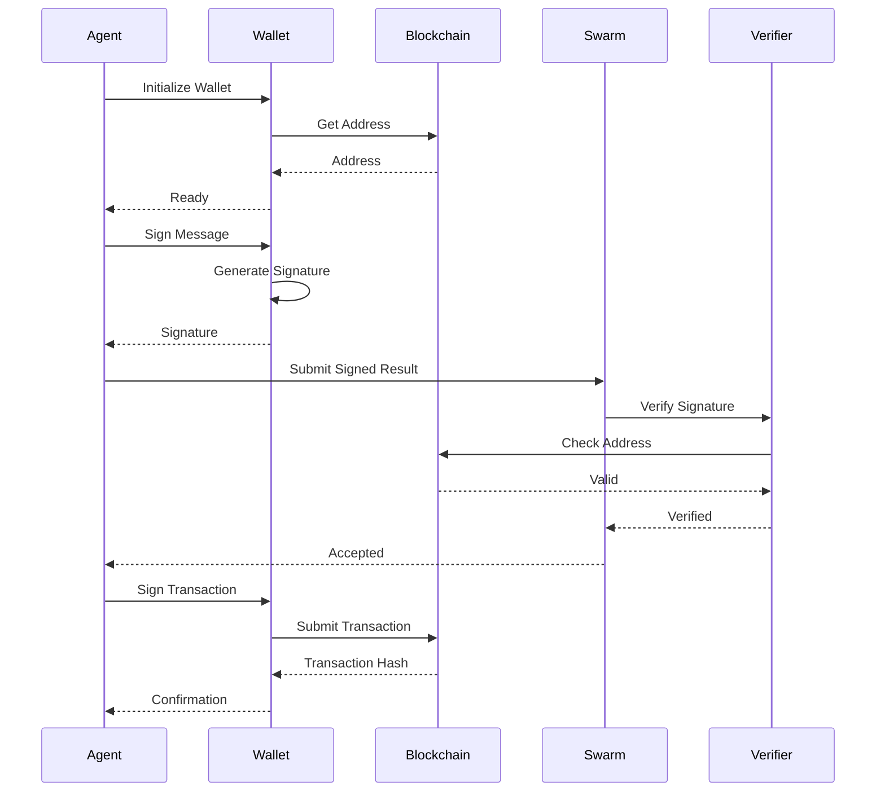

## Wallet Operation States
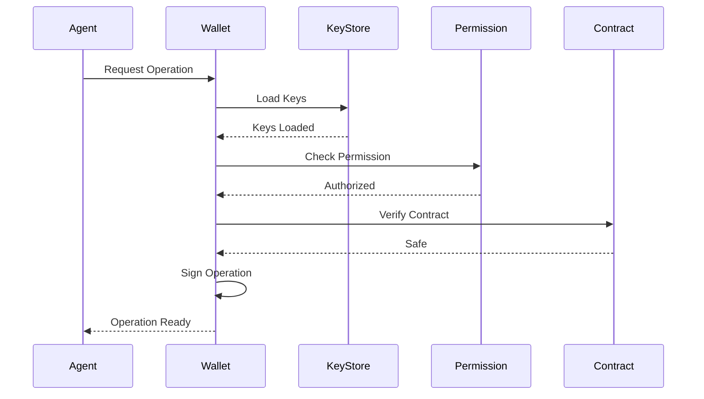

## Multi-Wallet Consensus
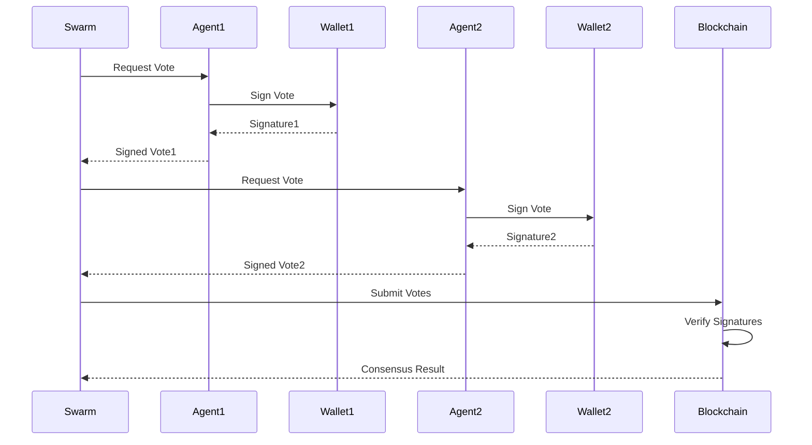
