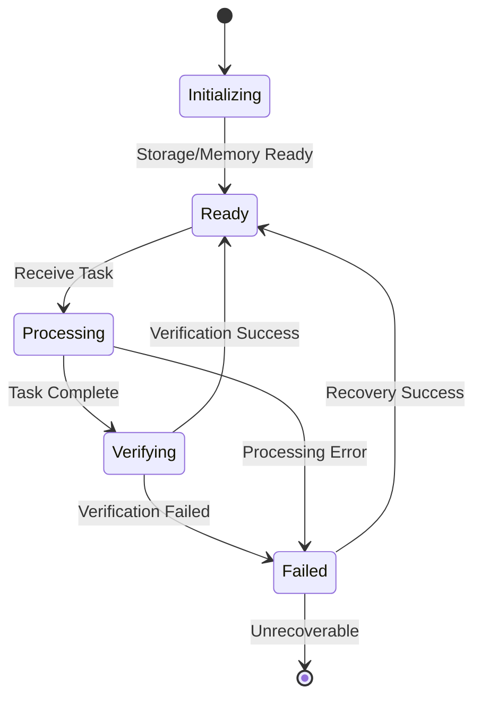
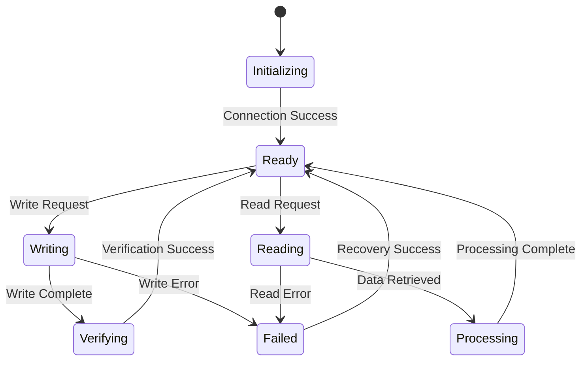
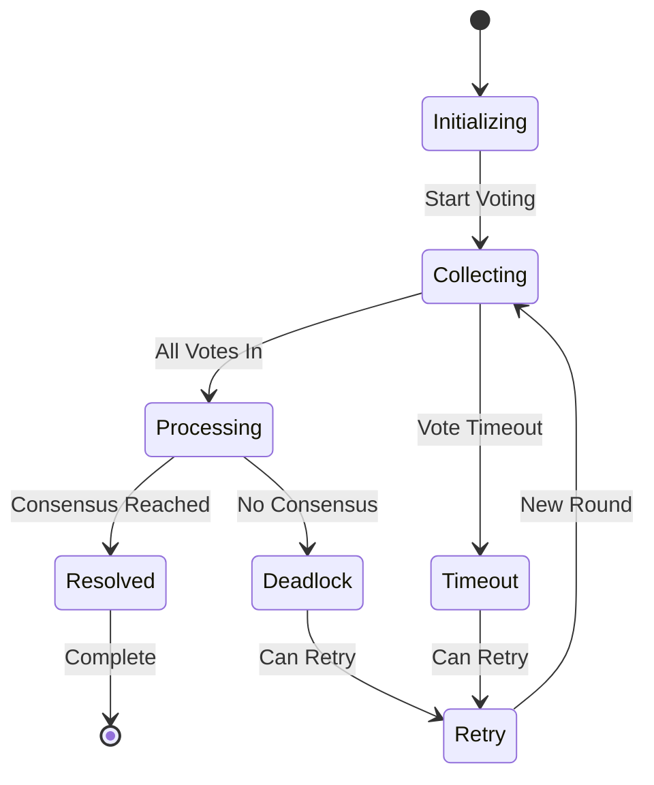

# Swarms-Rust State Transitions

## Agent States

```mermaid
stateDiagram-v2
    [*] --> Initializing
    Initializing --> Ready: Storage/Memory Ready
    Ready --> Processing: Receive Task
    Processing --> Verifying: Task Complete
    Verifying --> Ready: Verification Success
    Verifying --> Failed: Verification Failed
    Processing --> Failed: Processing Error
    Failed --> Ready: Recovery Success
    Failed --> [*]: Unrecoverable
```

## Swarm States

```mermaid
stateDiagram-v2
    [*] --> Initializing
    
    state Initializing {
        [*] --> AgentDiscovery: Start Discovery
        
        state AgentDiscovery {
            [*] --> DetectingAgents
            DetectingAgents --> RangingAgents: Agents Found
            RangingAgents --> OrderingAgents: Capabilities Known
            OrderingAgents --> AgentsDetected: Order Established
            
            DetectingAgents --> DetectingAgents: New Agent Found
            RangingAgents --> DetectingAgents: Insufficient Capabilities
            OrderingAgents --> RangingAgents: Invalid Order
        }
        
        AgentDiscovery --> GroupFormation: Agents Detected
        
        state GroupFormation {
            [*] --> ValidatingGroup
            ValidatingGroup --> AssigningRoles: Group Size Valid
            AssigningRoles --> GroupValidated: Roles Assigned
            
            ValidatingGroup --> ValidatingGroup: Check Requirements
            AssigningRoles --> ValidatingGroup: Missing Capabilities
        }
        
        GroupFormation --> OrchestrationSetup: Group Validated
        
        state OrchestrationSetup {
            [*] --> ConfiguringAgents
            ConfiguringAgents --> EstablishingConnections: Agents Configured
            EstablishingConnections --> SetupComplete: Connections Ready
            
            ConfiguringAgents --> ConfiguringAgents: Update Config
            EstablishingConnections --> ConfiguringAgents: Connection Failed
        }
        
        OrchestrationSetup --> ReadinessCheck: Setup Complete
        
        state ReadinessCheck {
            [*] --> VerifyingMinimalGroup
            VerifyingMinimalGroup --> CheckingCapabilities: Group Size Valid
            CheckingCapabilities --> ReadinessVerified: Required Capabilities Present
            
            VerifyingMinimalGroup --> VerifyingMinimalGroup: Wait for Agents
            CheckingCapabilities --> VerifyingMinimalGroup: Missing Requirements
        }
    }
    
    Initializing --> Ready: Minimal Group Ready
    
    state Ready {
        [*] --> Idle
        Idle --> TaskValidation: Task Received
        TaskValidation --> AgentSelection: Task Valid
        AgentSelection --> [*]: Agents Selected
    }
    
    Ready --> Distributing: New Task
    Distributing --> Processing: Task Assigned
    Processing --> ConsensusBuilding: Results Ready
    ConsensusBuilding --> Completing: Consensus Reached
    ConsensusBuilding --> Retrying: No Consensus
    Completing --> Ready: Task Complete
    Retrying --> Distributing: Retry Task
    
    state Processing {
        [*] --> AgentExecution
        AgentExecution --> ResultCollection: Execution Complete
        ResultCollection --> ValidationCheck: Results Collected
        ValidationCheck --> [*]: Results Valid
        
        AgentExecution --> AgentFailure: Execution Error
        ValidationCheck --> AgentExecution: Invalid Results
    }
    
    Processing --> Failed: Agent Failure
    Failed --> Ready: Recovery Success
    Failed --> Initializing: Rebuild Required
    
    note right of Initializing
        Swarm ensures minimal viable
        agent group before proceeding
    end note
    
    note right of Ready
        Requires configured number
        of capable agents
    end note
    
    note right of Processing
        Monitors agent health and
        execution progress
    end note
```

## Storage States

```mermaid
stateDiagram-v2
    [*] --> Initializing
    Initializing --> Ready: Connection Success
    Ready --> Writing: Write Request
    Ready --> Reading: Read Request
    Writing --> Verifying: Write Complete
    Reading --> Processing: Data Retrieved
    Verifying --> Ready: Verification Success
    Processing --> Ready: Processing Complete
    Writing --> Failed: Write Error
    Reading --> Failed: Read Error
    Failed --> Ready: Recovery Success
```

## Consensus States

```mermaid
stateDiagram-v2
    [*] --> Initializing
    Initializing --> Collecting: Start Voting
    Collecting --> Processing: All Votes In
    Collecting --> Timeout: Vote Timeout
    Processing --> Resolved: Consensus Reached
    Processing --> Deadlock: No Consensus
    Timeout --> Retry: Can Retry
    Deadlock --> Retry: Can Retry
    Retry --> Collecting: New Round
    Resolved --> [*]: Complete
```
